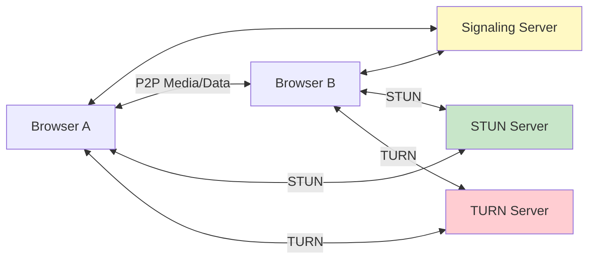

# WebRTC

Web Real-Time Communication (WebRTC) enables peer-to-peer audio, video, and data exchange directly between browsers without intermediate servers. It is the technology behind Google Meet, Discord voice, and many live streaming platforms.

## Architecture Overview



WebRTC has three main components:

- **MediaStream (getUserMedia)** — captures audio/video from cameras and microphones
- **RTCPeerConnection** — establishes and manages the peer-to-peer connection
- **RTCDataChannel** — sends arbitrary data between peers (text, files, binary)

## Signaling

WebRTC does not define a signaling protocol — applications implement their own (WebSocket, HTTP, etc.) to exchange two types of information:

1. **SDP (Session Description Protocol)** — describes media capabilities (codecs, resolution) and connection parameters
2. **ICE candidates** — network addresses the peer can be reached at

```javascript
// Signaling flow (simplified)
const pc = new RTCPeerConnection(config);

// Offerer
const offer = await pc.createOffer();
await pc.setLocalDescription(offer);
// Send offer via signaling server

// Answerer (receives offer)
await pc.setRemoteDescription(offer);
const answer = await pc.createAnswer();
await pc.setLocalDescription(answer);
// Send answer via signaling server

// Both sides exchange ICE candidates
pc.onicecandidate = (event) => {
  if (event.candidate) signaling.send(event.candidate);
};
```

## NAT Traversal: STUN and TURN

Most peers sit behind NATs and firewalls, so direct connections require NAT traversal.

| Protocol | Purpose | When Used | Cost |
|---|---|---|---|
| **STUN** | Discover public IP and port | First attempt for P2P | Low (lightweight queries) |
| **TURN** | Relay all traffic through a server | Fallback when P2P fails | High (bandwidth costs) |

**STUN** helps peers discover their public-facing address. **ICE** (Interactive Connectivity Establishment) tries STUN candidates first, then falls back to TURN if direct connection fails. Always configure a TURN server as fallback — approximately 10-15% of connections require it.

## ICE (Interactive Connectivity Establishment)

ICE gathers candidate addresses in priority order:

1. **Host candidates** — local network addresses
2. **Server-reflexive candidates** — public IP discovered via STUN
3. **Relay candidates** — TURN server address

The peer connection tests each candidate pair until one succeeds.

## Data Channels

RTCDataChannel enables arbitrary P2P data transfer:

```javascript
const channel = pc.createDataChannel('chat');

channel.onopen = () => channel.send('Hello peer!');
channel.onmessage = (e) => console.log('Received:', e.data);

// Ordered, reliable delivery (like TCP)
const reliable = pc.createDataChannel('file', { ordered: true });

// Unordered, unreliable delivery (like UDP — for real-time data)
const fast = pc.createDataChannel('game', {
  ordered: false,
  maxRetransmits: 0
});
```

## Interview Questions

**Q1: What role does the signaling server play in WebRTC?**
A: The signaling server exchanges SDP offers/answers and ICE candidates between peers. It is NOT in the media path — once the peer connection is established, media flows directly between browsers. The signaling protocol is application-defined (WebSocket, HTTP, etc.).

**Q2: What is the difference between STUN and TURN?**
A: STUN servers help peers discover their public IP address for NAT traversal — they return the address but don't relay traffic. TURN servers relay all media/data when direct P2P connection fails (e.g., symmetric NATs). STUN is cheap; TURN is expensive because it carries all traffic.

**Q3: When would you use a DataChannel instead of WebSocket?**
A: DataChannel is P2P with lower latency and no server bandwidth cost — ideal for real-time collaboration, file sharing, and gaming. WebSocket routes through a server — better for client-server communication, reliable delivery guarantees, and when P2P is not feasible.

**Q4: What is SDP and what does it contain?**
A: SDP (Session Description Protocol) is a text format describing a media session. It contains the caller's IP, supported codecs (VP8, H.264, Opus), media types (audio/video), and transport parameters. Both the offer and answer are SDP messages.

**Q5: Why is TURN necessary if STUN works most of the time?**
A: STUN fails with symmetric NATs (where the NAT maps different external ports for different destinations) and restrictive firewalls. Without TURN, these peers cannot connect at all. Production WebRTC applications always provision TURN as a fallback.

## Cross-References

- [WebSockets](websockets.md) — Alternative real-time communication (client-server)
- [HTTP Fundamentals](http-fundamentals.md) — Underlying transport and TLS
- [Security](security-deep.md) — DTLS/SRTP encryption in WebRTC

## References

- [WebRTC — MDN](https://developer.mozilla.org/en-US/docs/Web/API/WebRTC_API)
- [WebRTC in the Real World — webrtcHacks](https://webrtcHacks.com/)
- [ICE Protocol — RFC 8445](https://datatracker.ietf.org/doc/html/rfc8445)
